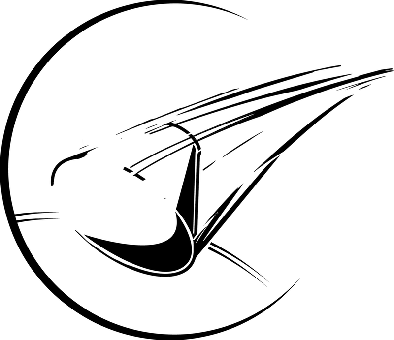

Welcome to the ablator docs, which contain information about how ablator works in depth, tips on how
to access ablator from various app types, and tutorials on how to achieve certain goals using
ablator.

These pages are hosted on [github](https://github.com/ablator/website/). If you have improvements,
corrections, or even new additions, we'd be very happy to accept your pull request.

<h2>{{ site.data.docs_list.docs_list_title }}</h2>
<ul>
   
      <li><a href="{{ item.url }}" alt="{{ item.title }}">{{ item.title }}</a></li>
   
</ul>