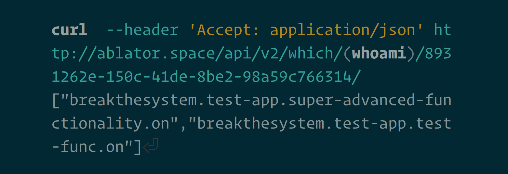

<section class="text-center my-5">
    
</section>
<section>
    <h1 class="display-1">
        Roll out at your own pace
    </h1>

    

        Ablator is a Service that enables you to <strong>roll out functionalities in a controlled way</strong>,
        and perform <strong>good A/B testing</strong>.
    

    

        

            

                <h4 class="card-title">Controlled Rollout</h4>
                

                    <strong>You have 40.000 users.</strong> Do you want all of them to hit your
                    server at once after that new
                    update? If not, consider carefully and systematically releasing your new
                    functionality with ablator.
                

            

        

        

            

                <h4 class="card-title">A/B Testing</h4>
                

                    <strong>Your new app design could go two, three, many tasty ways.</strong>
                    Want to distribute each variant
                    among your users and see how they are doing? ablator keeps track which user
                    gets which flavor.
                

            

        

    

    

        It works like this:
    <ol>
        <li>You define your app's switchable functionalities in ablator.</li>
        <li>Your app asks ablator <strong>"User X wants Functionality Y. Which Flavor should
            they get, if any?"</strong>
        </li>
        <li>ablator takes care of rolling out the feature in a way that you define.</li>
    </ol>

    As an administrator, you'll get a nice overview of what percentage of users has a
    functionality enabled. 😎
    

    

        <a href="http://ablator.space" class="btn btn-primary btn-lg mb-2">Register Now! It's free!</a>
         
        <a href="https://github.com/ablator/ablator/" class="btn btn-outline-secondary">Check
            it out on GitHub</a>

        <a href="https://twitter.com/ablator_io"
           class="btn btn-outline-secondary">Follow <strong>@ablator_io</strong> on
            Twitter</a>
    

</section>

<section>
    <h2>Try It Out BETA</h2>
    
For free even!

    

        

            

                <strong>Ablator is in an extended Beta period where the service is fully usable,
                    but the UI is a bit rough around the edges.</strong> To iron everything out,
                and to let you <a href="http://ablator.space/">fearlessly try it without any
                commitment</a>, you can use the hosted version of ablator completely free of
                charge.
            

            

                The software will always be open-source, and you will always be able to
                self-host it for free.
            

            

                If you choose to use hosted ablator in the beta period, and want to switch to
                self-hosted at a later point, we'll do our best to help you migrate your data.
            

        

        

            

                

                    <h4 class="card-title">Come to Space!</h4>
                    

                        The hosted version of ablator is at <a href="http://ablator.space"
                                                               class="text-white">ablator.space</a>!
                        You should try it out and then tell us how you like it! Your feedback is
                        awesome!
                    

                    <a href="http://ablator.space/" class="btn btn-primary">Register at
                        ablator.space BETA</a>
                    

                        <small>It's free and quite stable, but please be advised that we take no
                            responsibilty for lost data at this point.
                        </small>
                    

                

            

        

    

</section>

<section>
    <h2 class="mt-5 pt-5">You can access ablator from your App</h2>
    
Either use these libraries, or make a simple web request.

    

        

            

                
            

            

            <h4 class="card-title">Python Library</h4>
                <a href="https://github.com/ablator/karman"
                   class="btn btn-outline-secondary btn-block">Karman
                    on GitHub</a>
            

        

        

    

        

            
        

    

    

        <h4 class="card-title">Swift Library</h4>
        <a href="https://github.com/ablator/shepard"
           class="btn btn-outline-secondary btn-block">Shepard
            on GitHub</a>
    

        

        

            
        

        
    

    

            

                <h4 class="card-title">NodeJS Library</h4>
                <a href="https://github.com/ablator/herschel"
                   class="btn btn-outline-secondary btn-block">Herschel
                    on GitHub</a>
            

        

    

                
                

            

            <h4 class="card-title">Roll Your Own</h4>
                <a href="https://github.com/ablator/ablator"
                   class="btn btn-outline-secondary btn-block">Ablator
                    on GitHub</a>
            

        

    

</section>

<section>
    <h2 class="mt-5 pt-5">Some Screenshots, for your viewing pleasure:</h2>
    

    
    

    
    

    
    

    

</section>